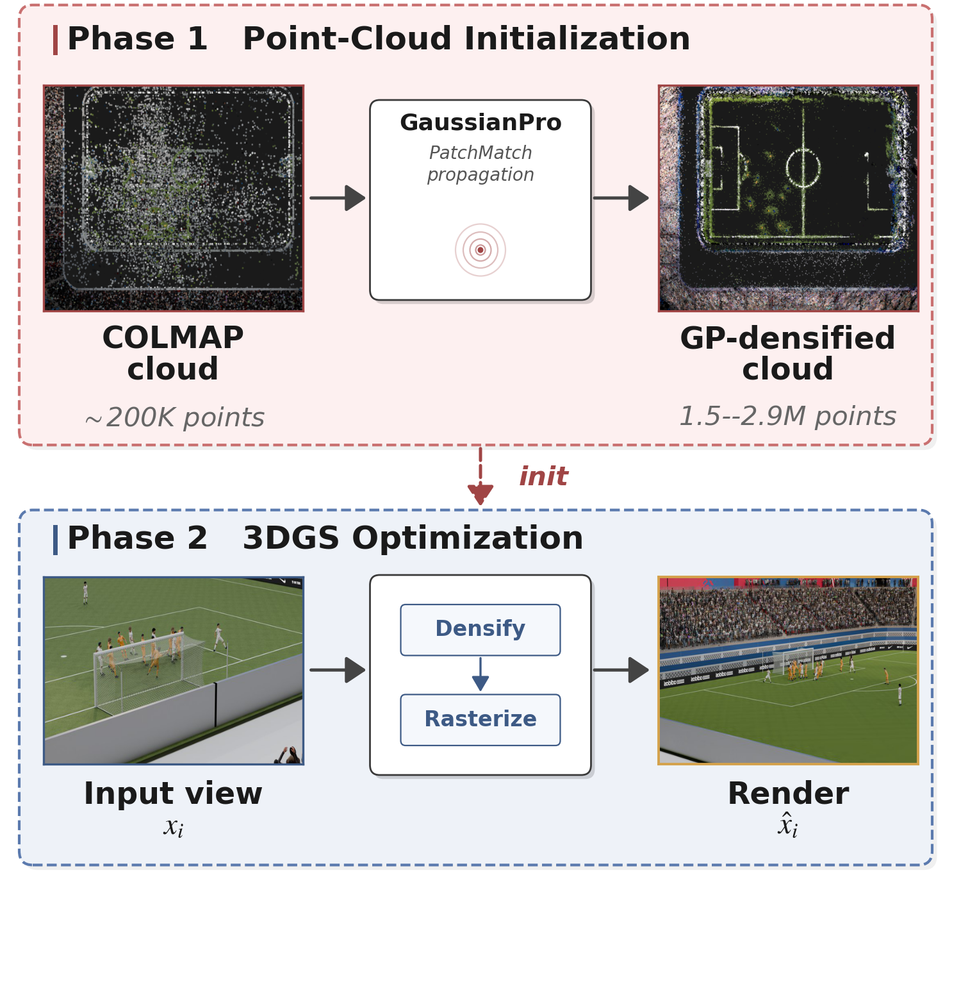

# 🥈 SoccerNet 2026 Novel View Synthesis Challenge — 2nd Place

Final challenge PSNR: **28.94 dB** (official 3DGS baseline: 26.74 dB,
**+2.20 dB**).

This repository contains the scripts and the technical report for our
submission. The training code comes from the official
[3D Gaussian Splatting](https://github.com/graphdeco-inria/gaussian-splatting)
and [GaussianPro](https://github.com/kcheng1021/GaussianPro)
repositories. See [`report/main.pdf`](report/main.pdf) for the
method.



## 🧩 Method

- 🌀 **Phase 1 — Point-cloud initialization.**
  - GaussianPro PatchMatch depth propagation on top of the COLMAP cloud
  - 12K iterations; spatial K-NN over camera centres (K = 4)
  - Output: ≈200K → **1.5–2.9M points** per scene
- ⚙️ **Phase 2 — Antialiased 3DGS training.**
  - Initialized from the GaussianPro cloud
  - All 421 training views per scene
  - Antialiasing filter on; rendered at 2048 × 1080
  - Densification gradient threshold $\tau_g = 1.2 \times 10^{-4}$
  - D-SSIM loss weight λ = 0.22, densification interval 125
- 🔄 **Schedule sweep.** Three long-horizon schedules
  $(T, T_{\mathrm{du}}) \in$
  - (50K, 27K) — short
  - (60K, 40K) — medium
  - (70K, 45K) — long

## 🎯 Submission best configuration

| Scene | Schedule $(T, T_{\mathrm{du}})$ | Challenge PSNR |
|:-----:|:------------------:|:--------------:|
|   1   | (70K, 45K)         | 28.40 |
|   2   | (50K, 27K)         | 29.14 |
|   3   | (70K, 45K)         | 30.23 |
|   4   | (50K, 27K)         | 28.85 |
|   5   | (60K, 40K)         | 28.07 |
| **mean** |                | **28.94** |

Scene 5 with the long schedule (70K, 45K) exceeds 46 GB VRAM during
densification; the medium schedule is used instead.

## 🔁 Reproduction

### 📦 Prerequisites
- **Hardware:** NVIDIA A40 (46 GB) or equivalent
- **Software:** two `conda` envs (PatchMatch only builds for Python 3.10):
  - `gaussianpro` — Python 3.10, PyTorch 2.6 (CUDA 12.4) — step 1
  - `gaussian_splatting` — Python 3.7, PyTorch 1.12.1 (CUDA 11.6) — steps 2-3
- **Dataset:** [SN-NVS-2026](https://huggingface.co/datasets/SoccerNet/SN-NVS-2026)
- **Submodules** (`git clone --recursive` or
  `git submodule update --init --recursive` after cloning):
  - `submodules/sn-nvs` — SoccerNet NVS toolkit (provides
    `render_challenge.py` and the 3DGS code as a nested submodule)
  - `submodules/GaussianPro` — GaussianPro (provides the CUDA
    PatchMatch `Propagation/` module)

### 📁 Expected layout

- Official 3DGS·GaussianPro are pinned submodules; our only additions are `scripts/gp_ply_to_colmap.py` and `patches/gaussianpro_knn.patch` (auto-applied by step 1).
- Dataset, outputs and submission live outside the repo — set the `$…` vars to the paths marked below.

```
<repo_root>/                           # this repository
├── scripts/                           # orchestration wrappers
│   ├── 1_gp_init.sh                   # step 1 (GaussianPro native train.py)
│   ├── 2_train_{short,medium,long}.sh # step 2 (3DGS schedules)
│   ├── 3_submit.sh                    # step 3 (render + zip)
│   └── gp_ply_to_colmap.py            # Gaussian-splat → COLMAP conv.
├── patches/gaussianpro_knn.patch      # our GaussianPro changes (step 1 auto-applies)
├── submodules/
│   ├── sn-nvs/submodules/gaussian-splatting/   # = $GS_DIR
│   └── GaussianPro/                   # = $GP_DIR
└── report/

<elsewhere>/
├── SN-NVS-2026/
│   ├── all_scenes_train_views/        # = $DATA_DIR  (scene-{1..5};
│   │                                  #   scene-{1..5}-gp auto-created by step 1)
│   └── all_scenes_challenge_views/    # = $CHALLENGE_DATA_DIR
├── output/                            # = $OUT_DIR
└── submission/                        # = $SUBMIT_DIR
```

### ▶️ Steps

```bash
# 1. GaussianPro depth propagation (per-scene).
#    Also auto-creates $DATA_DIR/scene-{1..5}-gp for step 2.
conda activate gaussianpro
bash scripts/1_gp_init.sh

# 2. Train the three long-horizon schedules for all 5 scenes
conda activate gaussian_splatting
bash scripts/2_train_short.sh    # (50K, 27K)
bash scripts/2_train_medium.sh   # (60K, 40K)
bash scripts/2_train_long.sh     # (70K, 45K)

# 3. Render challenge views with the per-scene best schedule
#    and pack a Codabench-ready submission.zip
bash scripts/3_submit.sh
```

### ⚠️ Reproducibility note

Step 1 OOMs before 12K, so the stop iteration (and point count) is
hardware-dependent; `1_gp_init.sh` uses the last checkpoint.
Ours:

| scene | 1 | 2 | 3 | 4 | 5 |
|:--|:-:|:-:|:-:|:-:|:-:|
| stop iter | 11000 | 9500 | 7000 | 11000 | 10500 |
| points | 2.92M | 1.60M | 1.55M | 2.36M | 2.60M |

A different stop point yields a slightly different init cloud, so the
final PSNR may deviate slightly from the reported 28.94.

## 📄 License

MIT — see [`LICENSE`](LICENSE).
